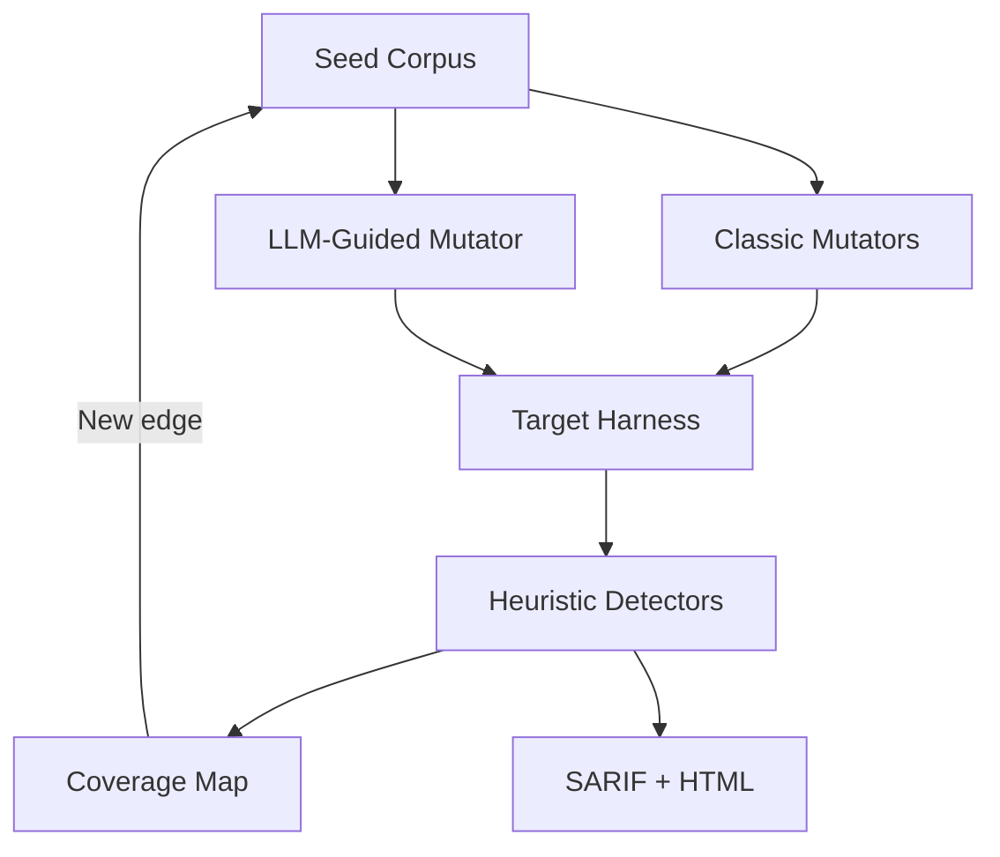

# AEGIS Fuzzer

The AEGIS fuzzer combines traditional mutational fuzzing with offline LLM guidance. It targets HTTP applications and records coverage by hashing response metadata. Findings are exported as SARIF and HTML reports for downstream triage.

## Workflow



## Usage

```bash
# Ensure the vulnerable target is running
docker compose up --build -d vulnerable_flask

# Launch a short fuzzing session
uv run python -m aegis_fuzzer.cli --target http://localhost:5001 --budget 60
```

Generated reports are stored under `aegis-fuzzer/reports/`.

## API

Run `uv run uvicorn aegis_fuzzer.app.main:app --reload` to expose the following endpoints:

- `POST /fuzz` — launch a fuzzing session (target URL + budget)
- `GET /runs` — list archived runs
- `GET /runs/latest` — fetch the latest run summary

## Testing

```bash
uv run pytest aegis_fuzzer/tests
```

The unit tests mock the HTTP harness to keep execution offline and deterministic.

