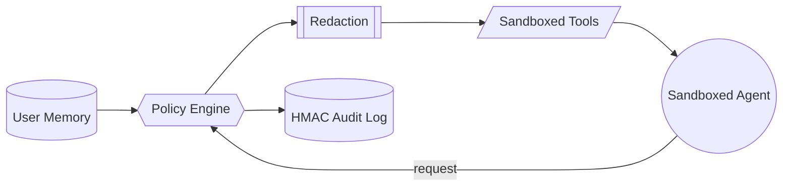

# AEGIS Guard

AEGIS Guard is an offline policy sandbox that prevents sensitive data exfiltration when AI agents call external tools. Policies are defined in YAML, evaluated deterministically, and every decision is recorded with an HMAC signature.

## Architecture



## Usage

```bash
# Launch the sandbox API
uv run uvicorn aegis_guard.app.main:app --reload --port 8000

# Submit a chat request
http POST :8000/chat prompt="Share project secrets"

# Invoke a tool through the sandbox
http POST :8000/tools/fetch tool=http_fetch args:='{"url": "https://example.com"}'
```

Denied requests return HTTP 403 along with policy metadata explaining the decision.

## Testing

```bash
uv run pytest aegis_guard/tests
```

Tests cover policy allow/deny flows, redaction behaviour, and injection blocking.

